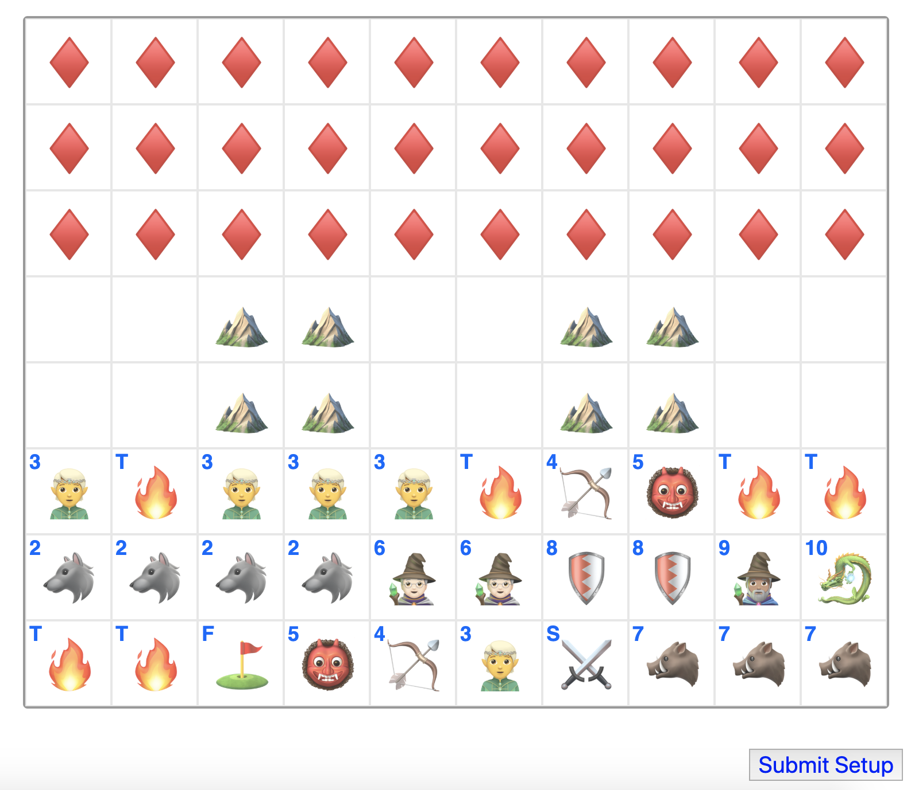
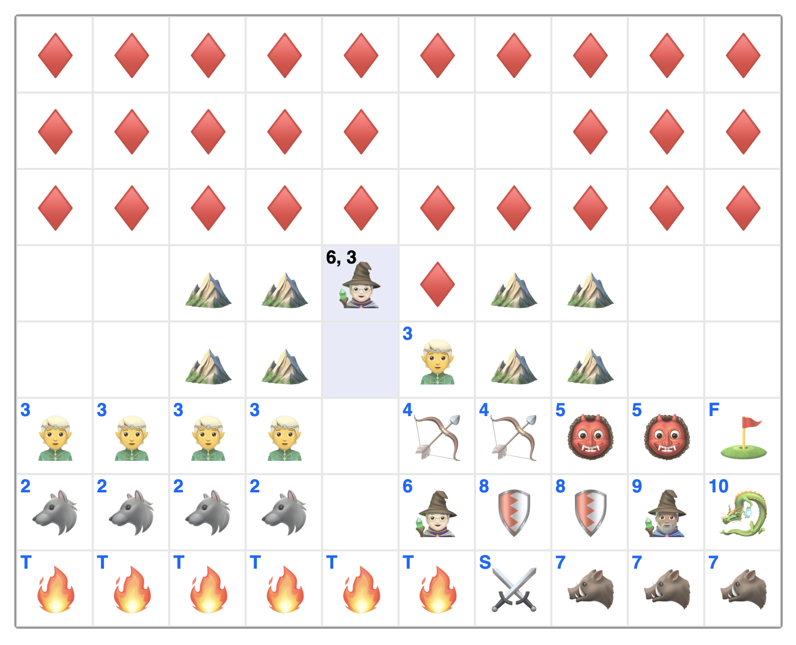
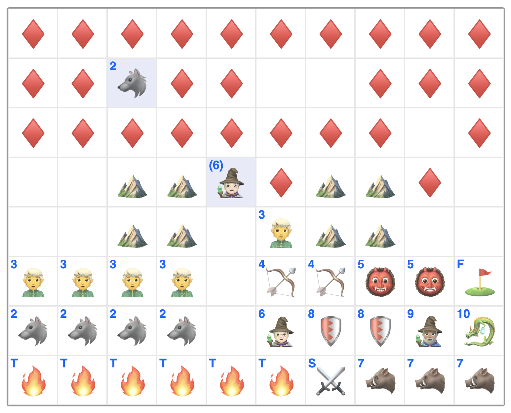

# Stratego

This version of Stratego is based on a special edition version of the popular board game. The main difference between this special edition and the original game is that every piece now has additional powers. See the **Gameplay** section for more details.

## Gameplay

Stratego is a 2-player game where each player's army is hidden from the other. The goal of the game is to capture your opponent's flag or destroy their entire army.

The first phase of the game involves setting up one's army. This can be achieved be swapping any two pieces by clicking one, and then the other.

Once your army is set up, you can click the "Submit Setup" button to  indicate to your opponent that you are ready to play. The second phase of the game involves moving pieces forward one square at a time to discover the positions of your opponent's pieces (note that most pieces have special powers, read the full rules below for full details).

Once an enemy piece is attacked, the values of the pieces are revealed. Whichever piece has a lower value is removed from the board; if the pieces have the same value, both pieces are removed from the board.

**Special cases**: The piece labelled `S` is the assassin, its value is usually counted as 1, except when it attacks the `10` (in this case, the `10` is destroyed). The pieces labelled `T` are traps; any piece attacking them will die, except for the `3` which can remove traps.

For a complete list of rules of the game, check out the [Hasbro Rules](https://www.hasbro.com/common/documents/dad288501c4311ddbd0b0800200c9a66/d15aa64019b9f36910b4ca23616082d8.pdf).

## Examples

Setting up one's army:

Attacking an enemy piece:

Example of a special power (the 6 can bring enemy pieces to your team):

